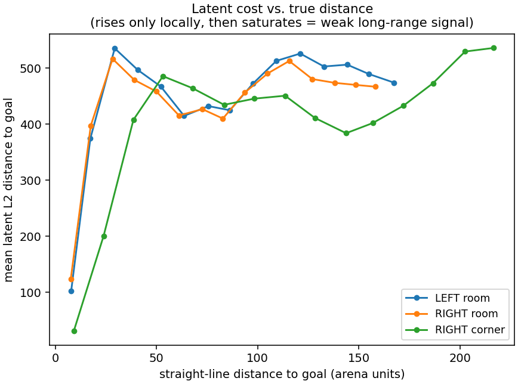
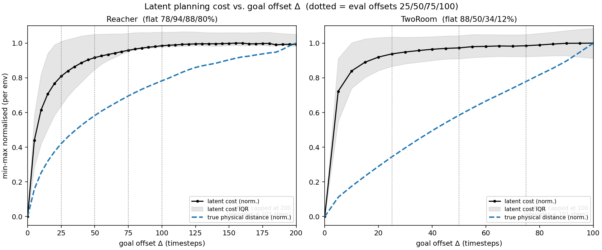

# Heat maps — offline latent diagnostics (TwoRoom & Reacher)

Qualitative diagnostics for LeWM / H‑LeWM. Each script encodes real dataset frames with
the **frozen** encoder and plots a latent quantity over physical position or goal offset.
No environment / MuJoCo — encoder forward passes only (seconds–minutes on GPU).

## Scripts

| Script | Output(s) | Tells you |
|---|---|---|
| `cost_landscape.py` | `cost_landscape_tworoom.png`, `cost_landscape_tworoom_vs_distance.png` | Static latent distance `‖E(s)−E(g)‖` over `(x,y)`, plus a `z→(x,y)` probe `R²` and a cost‑vs‑distance curve. The planner's cost is a **local basin + flat plateau** → why short‑horizon planning works and long‑horizon fails; position is decodable (`R²≈0.99`) yet raw L2 is a weak cost → **latent distance ≠ task distance**. *HP‑independent (pure encoder geometry).* |
| `latent_cost_vs_offset.py` | `latent_cost_vs_offset.png` | Latent planning cost and true goal distance vs. eval offset `Δ` for **Reacher** and **TwoRoom** side-by-side. Shows whether the cost saturates while physical distance keeps growing — the cross-environment explanation for long-horizon collapse. |

## Figures

**Static latent cost (TwoRoom)** — a small green basin at each goal, flat red plateau elsewhere → the encoder's distance is informative only *locally*:


**Cost vs. true distance (TwoRoom)** — cost rises only within ~30 arena units, then saturates → **latent distance ≠ task distance** beyond a local basin:



**Latent cost vs. goal offset (Reacher | TwoRoom)** — on TwoRoom the latent cost flattens before `Δ=25` while true distance keeps growing; on Reacher goals stay physically close so success holds even where the cost is flat:



## Run (from repo root `~/le-wm`; figures save next to the scripts)

```bash
STABLEWM_HOME=$HOME/.stable_worldmodel \
  .venv/bin/python "analysis/heat maps/cost_landscape.py" --device cuda

STABLEWM_HOME=$HOME/.stable_worldmodel \
  .venv/bin/python "analysis/heat maps/latent_cost_vs_offset.py" --device cuda
```

`--checkpoint <path>` switches the model used by `cost_landscape.py` (only the frozen encoder is used, so any TwoRoom LeWM checkpoint works).

## Caveats

- **`cost_landscape.py` is HP-independent** — it uses only the frozen encoder, so the local-basin / plateau geometry is a property of the latent space, not planner hyperparameters.
- **`latent_cost_vs_offset.py` uses flat stage-1 checkpoints** per environment (`baseline/reacher/lewm_epoch_10_object.ckpt`, `baseline/tworoom/lewm_epoch_9_object.ckpt`) and caps offset by episode length (~200 Reacher, ~100 TwoRoom).
- **TwoRoom heatmap is 2-D only:** `cost_landscape.py` assumes a 2-D `pos_agent` and hardcoded arena/goals. Other 2-D envs would need those parameterized; 3-D (OGB-Cube) does not map directly.
