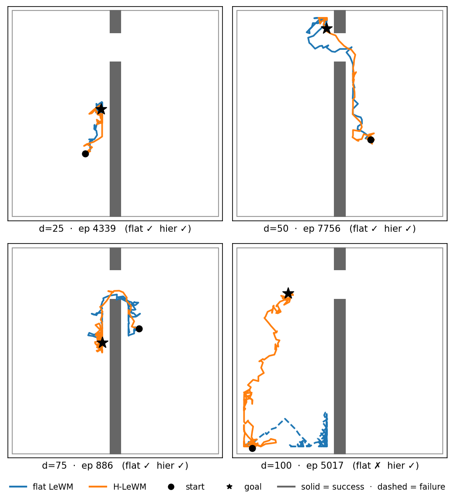

# Path trajectories — flat vs. hierarchical rollout paths (TwoRoom)

Qualitative companion to the success-rate numbers: plots the agent's actual `(x, y)`
path through TwoRoom under the **flat LeWM** planner vs. the **hierarchical H-LeWM**
planner, on the *same* episodes (identical start/goal pairs). Shows *where* each planner
goes and whether it reaches the goal.

Both planners use the **same checkpoint** (`results/hierarchical/tworooms/hierarchical_lewm_epoch_14_tworooms_object.ckpt`):
flat = the inner JEPA extracted via `AutoCostModel` driven by a single-level CEM; hier =
the full model with the two-level CEM. So any difference in the paths is the **planner**,
not the model (the clean "Option 2" ablation).

## How it works (two stages)

1. **Record** — run the eval scripts with `+record_trajectories=true`. The in-pipeline
   hook `traj_recording.py` (**in this folder**; `eval.py` and `plan_hierarchical.py`
   add this dir to `sys.path` to import it) snoops `info['proprio']` each step and dumps
   an `.npz` of per-step positions + start/goal + success flags next to the run's results.
2. **Plot** — `viz_trajectories.py` (per-horizon grid) or `viz_panel_grid.py` (hand-picked
   2×2 montage) reads the `.npz` files and renders: flat (blue) vs. hier (orange),
   solid = success, dashed = failure, ● start, ★ goal, with the TwoRoom wall + doorway
   drawn in. numpy + matplotlib only — no model, no env, instant.

## Replicating the horizon sweep

Run from repo root `~/le-wm`. **Output routing:** each script writes *all* its artifacts
(`.npz` + rollout `.mp4`s + `results.txt`) into the **parent directory of the checkpoint
path you give it**. So we give every horizon its **own** symlink folder under `runs/`;
reusing one folder for several horizons makes their results collide (don't do that).

### 0) One-time setup — per-horizon folders + ckpt symlinks

```bash
cd ~/le-wm
CKPT=$HOME/le-wm/results/hierarchical/tworooms/hierarchical_lewm_epoch_14_tworooms_object.ckpt
RUN="analysis/path_trajectories/runs"
mkdir -p "$RUN/figures"
for d in 25 50 75 100; do
  mkdir -p "$RUN/flat_d$d" "$RUN/hier_d$d"
  ln -sfn "$CKPT" "$RUN/flat_d$d/ckpt_object.ckpt"   # flat: AutoCostModel appends _object.ckpt
  ln -sfn "$CKPT" "$RUN/hier_d$d/ckpt.ckpt"          # hier: torch.load reads this directly
done
```

### 1) Per-horizon run (flat → hier → grid figure), **serially, on GPU**

Set `D` (offset) and `N` (episodes) per the table below; budget is always `2×D`
(the "fair budget", equal across planners — see Caveats).

| horizon `D` | episodes `N` | `eval_budget` (= 2·D) |
|---|---|---|
| 25 | 10 | 50 |
| 50 | 15 | 100 |
| 75 | 20 | 150 |
| 100 | 25 | 200 |

```bash
D=75; N=20                      # <- set per the table; eval_budget is computed as 2*D

# flat  -> runs/flat_d$D/   (single-level CEM; AutoCostModel extracts the inner JEPA)
STABLEWM_HOME=$HOME/.stable_worldmodel .venv/bin/python eval.py --config-name=tworoom.yaml \
  policy="$HOME/le-wm/$RUN/flat_d$D/ckpt" +cache_dir=$HOME/.stable_worldmodel seed=42 \
  eval.num_eval=$N eval.goal_offset_steps=$D eval.eval_budget=$((2*D)) +record_trajectories=true

# hier  -> runs/hier_d$D/   (two-level CEM; tuned h_low=3 outer_std=2.5, H_high=1 from config)
STABLEWM_HOME=$HOME/.stable_worldmodel .venv/bin/python plan_hierarchical.py \
  checkpoint="$HOME/le-wm/$RUN/hier_d$D/ckpt.ckpt" device=cuda seed=42 \
  eval.num_eval=$N eval.goal_offset_steps=$D eval.eval_budget=$((2*D)) \
  plan.h_low=3 plan.outer_std=2.5 +record_trajectories=true

# per-horizon grid figure -> runs/figures/trajectories_d$D.png
.venv/bin/python "analysis/path_trajectories/viz_trajectories.py" \
  --flat "$RUN/flat_d$D/trajectories_flat.npz" --hier "$RUN/hier_d$D/trajectories_hier.npz" \
  --out "$RUN/figures/trajectories_d$D.png" --max $N --ncols 5
```

### 2) Hand-picked 2×2 montage (one episode per horizon)

`viz_panel_grid.py` overlays flat + hier for one chosen episode per horizon. Edit the
`PANELS` list at the top of the script to pick `(label, horizon, episode_id)`; it reads
the already-recorded `.npz`, so **no reruns are needed**.

```bash
.venv/bin/python "analysis/path_trajectories/viz_panel_grid.py"
# -> runs/figures/horizon_2x2.png
```



*One representative episode per horizon (start ●, goal ★; solid = reached, dashed = failed).
At d=100 (ep 5017) the hierarchical planner makes one long coherent traversal to the
far-room goal that the flat planner fails to reach.*

## Single-run results (seed=42, tight budget = 2·D)

| `D` | `N` | flat | H-LeWM |
|---|---|---|---|
| 25 | 10 | 100% (10/10) | 50% (5/10) |
| 50 | 15 | 33% (5/15) | 40% (6/15) |
| 75 | 20 | 40% (8/20) | 15% (3/20) |
| 100 | 25 | 24% (6/25) | 16% (4/25) |

Flat ≥ hier at every horizon except the near-tie at d=50; hier's successes cluster on the
nearer goals. **Treat these as single-draw, not significant:** `N` is small and hier's CEM
is unseeded (below), so a 1–2-episode flip moves the rate by 5–10 points. For publishable
numbers, raise `N` to 50–100 and seed the hier CEM.

## Files
| File | Role |
|---|---|
| `viz_trajectories.py` | offline plotter: two `.npz` (one horizon) → per-episode grid figure |
| `viz_panel_grid.py` | offline plotter: hand-picked `(horizon, episode)` cells → 2×2 montage (edit `PANELS`) |
| `traj_recording.py` | in-pipeline recorder imported by `eval.py` / `plan_hierarchical.py` (which `sys.path`-insert this folder to find it) |

## Caveats
- **TwoRoom-only:** arena / wall / door geometry is hardcoded in `viz_trajectories.py`, and it plots the 2-D `proprio` position. Other 2-D envs need those constants parameterized; 3-D (OGB-Cube) doesn't map.
- **Same episodes required:** flat & hier must share `seed` + `goal_offset_steps` (+ `num_eval`) so the two `.npz` align by episode id. (Each horizon samples a *different* episode set, so an episode id only exists in the horizon that drew it.)
- **Fair budget:** the runs use `eval_budget = 2 × goal_offset` for **both** planners — anchored to the demonstration's optimal path length and equal across planners, so neither gets extra time to "crawl in". A larger budget inflates success (especially for the slower planner); a *generous-but-equal* budget is the legitimate way to test long-horizon reach.
- **Hier is stochastic:** `hierarchical_plan.cem()` uses unseeded `torch.randn`, so the hier success rate varies run-to-run (observed ~20-pt swing on identical d=25 inputs). The flat solver is seeded/deterministic. Add `torch.manual_seed(cfg.seed)` in `plan_hierarchical.run()` to make hier reproducible.
- **Run evals serially** (one at a time), not in parallel — sustained ~97% GPU under parallel eval has correlated with crashes on the laptop 5090.
