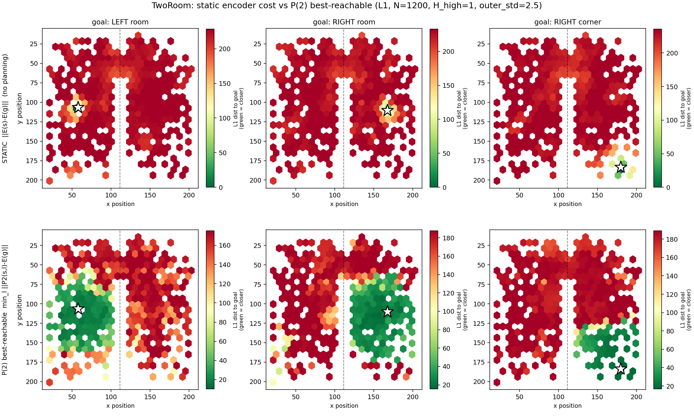
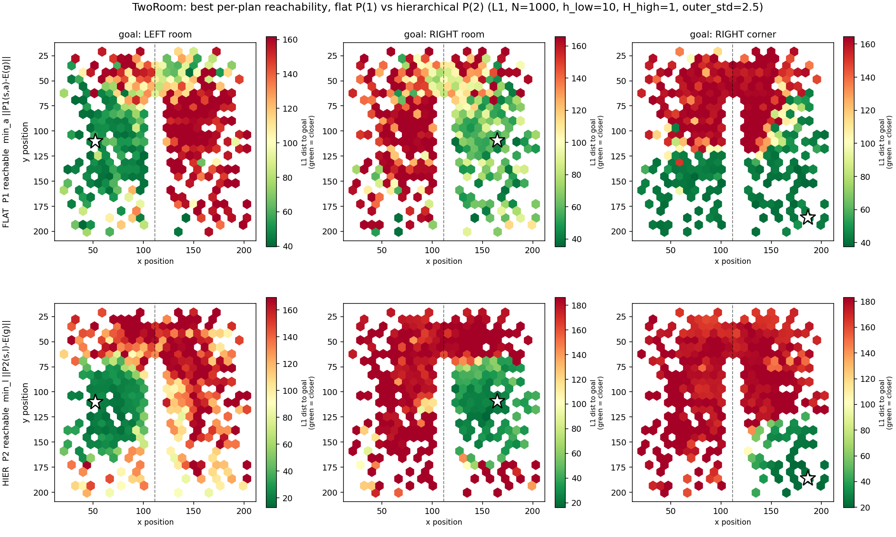

# Heat maps — offline latent diagnostics (TwoRoom)

Qualitative diagnostics for LeWM / H‑LeWM. Each script encodes real TwoRoom frames with
the **frozen** encoder and plots a latent quantity over the agent's true `(x, y)`.
No environment / MuJoCo — encoder/predictor forward passes only (seconds–minutes on GPU).

## Scripts
| Script | Plots | Tells you |
|---|---|---|
| `cost_landscape.py` | static latent distance `‖E(s)−E(g)‖` over `(x,y)`, plus a `z→(x,y)` probe `R²` and a cost‑vs‑distance curve | the planner's cost is a **local basin + flat plateau** → why short‑horizon planning works and long‑horizon fails; position is decodable (`R²≈0.99`) yet raw L2 is a weak cost → **latent distance ≠ task distance**. *HP‑independent (pure encoder geometry) — the robust figure.* |
| `landscape_reachability_pair.py` | best per‑plan reach to goal: **flat P¹** (top) vs **hierarchical P²** (bottom) | whether the macro level out‑reaches the micro level *per plan* — the 1‑to‑1 macro‑vs‑micro comparison. |
| `landscape_static_vs_highlevel.py` | static field (top) vs **P² best‑reachable** (bottom) | macro planner vs *no* planning (asymmetric — prefer the pair above). |
| `_landscape_lib.py` | — | shared helpers (not run directly). |

## Figures (TwoRoom, tuned: `H_high=1`, `outer_std=2.5`)

**Static latent cost** — a small green basin at each goal, flat red plateau elsewhere → the encoder's distance is informative only *locally* (*HP‑independent*):


**Cost vs. true distance** — the same effect quantified: cost rises only within ~30 arena units, then saturates → **latent distance ≠ task distance** beyond a local basin:


**Macro planner vs. no planning** — static field (top, all red) vs the high‑level **P²** best‑reachable cost (bottom): the macro planner **carves a room‑sized reachable basin** out of the flat field; the wall stays an impassable barrier:



**Flat vs. hierarchical (1‑to‑1)** — best per‑plan reach, **flat P¹** (top) vs **hierarchical P²** (bottom): comparable per plan (macro marginally higher cost). A single‑plan map **cannot** show the hierarchy's multi‑step payoff — that needs a goal‑distance env sweep:



## Run (from repo root `~/le-wm`; figures save next to the scripts)
```bash
STABLEWM_HOME=$HOME/.stable_worldmodel .venv/bin/python "qualitative analysis/heat maps/cost_landscape.py" --device cuda
STABLEWM_HOME=$HOME/.stable_worldmodel .venv/bin/python "qualitative analysis/heat maps/landscape_reachability_pair.py" --device cuda
STABLEWM_HOME=$HOME/.stable_worldmodel .venv/bin/python "qualitative analysis/heat maps/landscape_static_vs_highlevel.py" --device cuda
```
`--checkpoint <path>` switches model (dims auto‑adapt; reachability scripts need a `HierarchicalLeWM`).

## Caveats
- **Reachability is single‑plan & HP‑sensitive** — it shows a *mechanism*, not the headline number, and **cannot** demonstrate the end‑to‑end "macro helps on top of micro" gain (that needs a goal‑distance **env eval**). `cost_landscape.py` is the HP‑independent one.
- **Both A and B** default to the tuned macro config (`H_high=1`, `outer_std=2.5`) and expose `--high-hhigh` / `--outer-std`. B's flat row uses `h_low=10` (a flat‑planner horizon, *not* the hierarchical inner `h_low=3`).
- **TwoRoom‑only:** assumes a 2‑D `pos_agent` and hardcoded arena/goals (`WALL_X`, `GOALS_XY` in `_landscape_lib.py`). Other 2‑D envs need those parameterized; 3‑D (OGB‑Cube) doesn't map.
