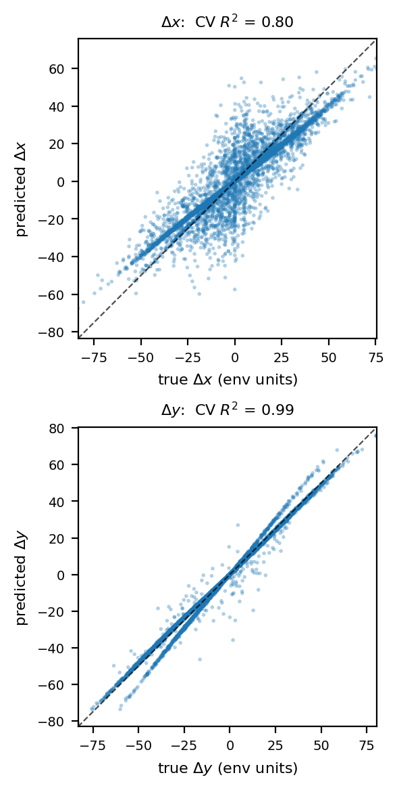

# Latent-space qualitative analysis — TwoRoom (H-LeWM)

Offline analysis that produces the **macro-action linear-probe** figure used in the
paper (Fig. `macro_probe`): it shows the hierarchy's learned macro-actions (`A_ψ`'s
8-d codes) **linearly encode the net motion** of the action chunk they summarize.
Loads a trained checkpoint, encodes dataset frames, fits the probe, and plots —
**no environment, no MuJoCo, no CEM planning, no training.** Light on GPU, crash-free.

> **Scope note.** This folder was trimmed to what the paper uses. The encoder-grid
> and macro-action t-SNE visualizations were removed — the paper tells the
> latent-distance story with the `heat maps/` cost-landscape figures instead. See
> `plans/latent_analysis.md` for the runbook + the deletion log.

## What it produces

| Script | Output | What it is |
|---|---|---|
| `macro_action_tsne.py` | `figures/macro_action_tworoom.npz` | Encodes real inter-waypoint action chunks into `A_ψ`'s 8-d macro-actions and saves them. **Data-generation step for the probe** (the `.npz` is its input). |
| `macro_probe.py` | `figures/macro_probe_tworoom.pdf` (+ `.png` preview) | 5-fold cross-validated **linear** probe: macro-action (8-d) → net motion (Δx, Δy). CV R²≈0.89 (Δy≈0.98, Δx≈0.80) ⇒ macros linearly encode motion. The `.pdf` is Fig. `macro_probe` in the paper. |



## Prerequisites

- Run from the repo root (`~/le-wm`) with the project venv (`.venv/bin/python`).
- `STABLEWM_HOME` points at the dataset cache (holds `tworoom.h5`, ~12 GB).
- **Checkpoint** (the Stage-2 `HierarchicalLeWM` object used for the paper; its `A_ψ`
  is what the probe reads): `models/hierarchical_lewm_epoch_14_tworooms_object.ckpt`.
- **Dependencies** (already in the venv): `torch`, `stable-worldmodel==0.0.6`,
  `transformers==4.57.6`, `scikit-learn`, `matplotlib`, `numpy`.
- GPU optional: `--device cuda` (default) or `--device cpu`.
- The folder name has a space (`qualitative analysis/`), so **quote the script path**.

## Reproduce the figure

```bash
cd ~/le-wm
export STABLEWM_HOME=$HOME/.stable_worldmodel
CKPT=$HOME/le-wm/models/hierarchical_lewm_epoch_14_tworooms_object.ckpt
DIR="qualitative analysis/latent_analysis"

# 1) extract A_ψ macro-actions -> figures/macro_action_tworoom.npz (the probe's input)
.venv/bin/python "$DIR/macro_action_tsne.py" --checkpoint "$CKPT" --device cuda

# 2) linear probe -> figures/macro_probe_tworoom.pdf (paper figure) + .png preview
.venv/bin/python "$DIR/macro_probe.py"
```

`macro_probe.py` reads the `.npz` written by step 1, so **run step 1 first.** (The probe
uses only the saved macro-actions/displacements, so step 1's `--perplexity`/t-SNE
settings don't affect the result.)

## Notes

- Output lands in `latent_analysis/figures/` (script-relative paths; works from any cwd).
- Deterministic (`--seed 0`); reruns reproduce the same figure and R².
- Offline (no env loop, no planning) — fast, and free of the GPU-load instability seen in CEM eval.

## Main knobs

| Script | Key args (defaults) |
|---|---|
| `macro_action_tsne.py` | `--num-windows 2000`, `--n-waypoints 4`, `--max-points 5000`, `--seed 0`, `--device`, `--out` |
| `macro_probe.py` | `--cv 5`, `--npz <…/figures/macro_action_tworoom.npz>`, `--out` |
