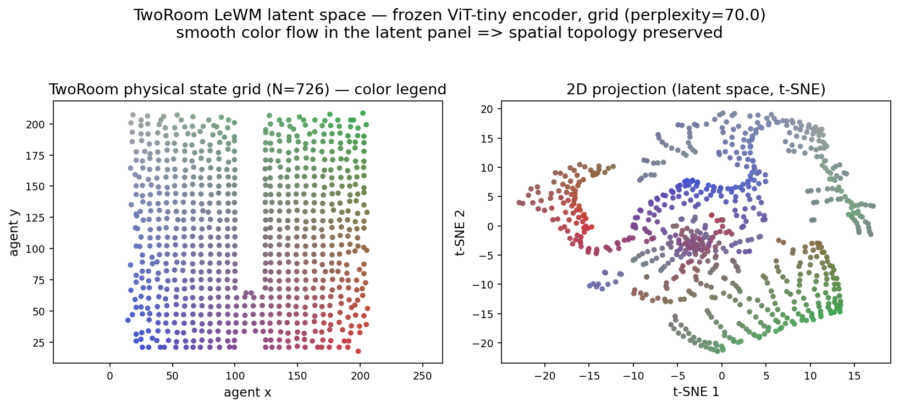
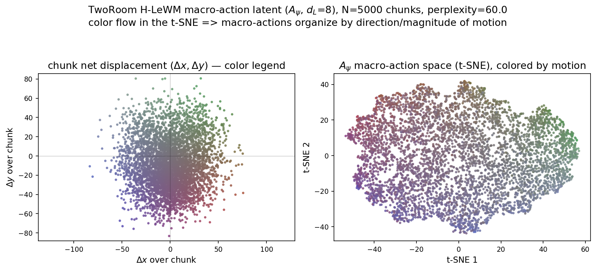

# Latent-space qualitative analysis — TwoRoom (LeWM / H-LeWM)

Three **offline** scripts that visualize the learned latent spaces of the TwoRoom
model for the CS231n report's qualitative analysis. They load a trained
checkpoint, encode dataset frames, and plot — **no environment, no MuJoCo, no CEM
planning, no training.** Light on GPU and crash-free.

## Figures produced

| Script | Figure | What it shows |
|---|---|---|
| `latent_grid_tsne.py` | `figures/latent_grid_tworoom.png` | The **frozen encoder** latent space (shared by flat & hierarchical). A grid of TwoRoom states is encoded and t-SNE'd; coloring by agent (x, y) shows the encoder represents spatial position (two-room topology preserved). Left = physical state grid (the color legend), right = latent t-SNE. |
| `macro_action_tsne.py` | `figures/macro_action_tworoom.png` | The **hierarchy's own latent**: A_ψ's 8-d macro-action space. Real inter-waypoint action chunks are encoded to macros and t-SNE'd, colored by the chunk's net motion (Δx, Δy). Shows A_ψ organizes macro-actions by direction/magnitude of motion. Also writes the `.npz` the probe needs. |
| `macro_probe.py` | `figures/macro_probe_tworoom.pdf` (+ `.png`) | **Quantitative** companion: a 5-fold cross-validated linear regression macro (8-d) → net motion (Δx, Δy), with a predicted-vs-true scatter. Reports CV R² (≈0.89; Δy≈0.98, Δx≈0.80) → macros *linearly* encode net motion. |

## The figures

### 1. Encoder latent space — `latent_grid_tworoom.png`



Frozen ViT-tiny latents over a 28×28 grid of TwoRoom states. Smooth color flow
from the physical grid (left) into the t-SNE (right) shows the shared
representation encodes agent position — the two-room topology is preserved.

### 2. Macro-action latent space (A_ψ) — `macro_action_tworoom.png`



The hierarchy's own latent. Real action chunks → 8-d macro-actions (A_ψ),
t-SNE'd and colored by net motion (Δx, Δy). Coherent color organization means
A_ψ encodes direction/magnitude of motion.

### 3. Macro-action linear probe — `macro_probe_tworoom.png`


Quantitative companion to figure 2: a 5-fold cross-validated linear probe from
each macro-action to its chunk's net motion. Overall CV R²=0.89 (Δx 0.80,
Δy 0.98); train R² = CV R² (no overfit) → macros *linearly* encode motion.
Single-column, Overleaf-ready vector at `figures/macro_probe_tworoom.pdf`.

## Prerequisites

- Run from the repo root (`~/le-wm`) with the project venv (`.venv/bin/python`).
- `STABLEWM_HOME` must point at the dataset/checkpoint cache (holds `tworoom.h5`).
- **Checkpoint:** the Stage-2 `HierarchicalLeWM` object (run `20260527_004340`, the
  TwoRoom 62% model) — all three scripts load it (the encoder figure uses its inner
  `.jepa`; the macro figures use `A_ψ`):
  `$STABLEWM_HOME/20260527_004340/hierarchical_lewm_object.ckpt`
- **Dataset:** `tworoom` (`$STABLEWM_HOME/tworoom.h5`, ~12 GB).
- **Dependencies** (already in the venv — nothing extra to install): `torch`,
  `stable-worldmodel==0.0.6`, `transformers==4.57.6`, `scikit-learn`, `matplotlib`,
  `numpy`.
- GPU optional: `--device cuda` (default) or `--device cpu` (works, slower for the
  encoding scripts).
- The folder name contains a space (`qualitative analysis/`), so **quote the script
  path** in every command.

## Recreate the figures

Set these once in your shell:

```bash
cd ~/le-wm
export STABLEWM_HOME=$HOME/.stable_worldmodel
CKPT=$STABLEWM_HOME/20260527_004340/hierarchical_lewm_object.ckpt
PY=.venv/bin/python
DIR="qualitative analysis/latent_analysis"
```

### 1 — Encoder latent space (position grid)

```bash
$PY "$DIR/latent_grid_tsne.py" --checkpoint "$CKPT" --device cuda \
    --grid 28 --perplexity 70 --num-windows 1000
# -> figures/latent_grid_tworoom.png (+ .npz)   ~2-3 min
```

### 2 — Macro-action latent space (A_ψ)

```bash
$PY "$DIR/macro_action_tsne.py" --checkpoint "$CKPT" --device cuda \
    --perplexity 60
# -> figures/macro_action_tworoom.png (+ .npz)   ~1 min
```

### 3 — Macro-action linear probe  (run AFTER step 2)

```bash
$PY "$DIR/macro_probe.py"
# -> figures/macro_probe_tworoom.pdf (+ .png preview)   seconds, CPU-only
```

`macro_probe.py` reads the `.npz` written by step 2, so **run step 2 first.**

### Recreate everything in one go

```bash
cd ~/le-wm
export STABLEWM_HOME=$HOME/.stable_worldmodel
CKPT=$STABLEWM_HOME/20260527_004340/hierarchical_lewm_object.ckpt
DIR="qualitative analysis/latent_analysis"

.venv/bin/python "$DIR/latent_grid_tsne.py"  --checkpoint "$CKPT" --device cuda --grid 28 --perplexity 70 --num-windows 1000
.venv/bin/python "$DIR/macro_action_tsne.py" --checkpoint "$CKPT" --device cuda --perplexity 60
.venv/bin/python "$DIR/macro_probe.py"
```

## Notes

- **Outputs** always land in `latent_analysis/figures/` (paths are script-relative,
  so the scripts work from any working directory). Re-running overwrites.
- **Deterministic:** all scripts use `--seed 0`; reruns reproduce identical figures
  (the probe's R² is therefore stable across reruns).
- The explicit flags above (`--grid 28 --perplexity 70 …`, `--perplexity 60`) are
  what produced the committed figures; the script **defaults differ** (grid 24,
  perplexity 40), so pass the flags to reproduce these exact images.
- These are offline analyses — no env loop, no planning — so they're fast and don't
  trigger the GPU-load instability seen during CEM evaluation.

## Main knobs

| Script | Key args (defaults) |
|---|---|
| `latent_grid_tsne.py` | `--grid 24` (cells/axis), `--perplexity 40`, `--num-windows 700`, `--num-steps 20`, `--frameskip 5`, `--seed 0`, `--device`, `--out` |
| `macro_action_tsne.py` | `--perplexity 40`, `--num-windows 2000`, `--n-waypoints 4`, `--max-points 5000`, `--num-steps 20`, `--frameskip 5`, `--seed 0`, `--device`, `--out` |
| `macro_probe.py` | `--cv 5`, `--npz <…/figures/macro_action_tworoom.npz>`, `--out` |
